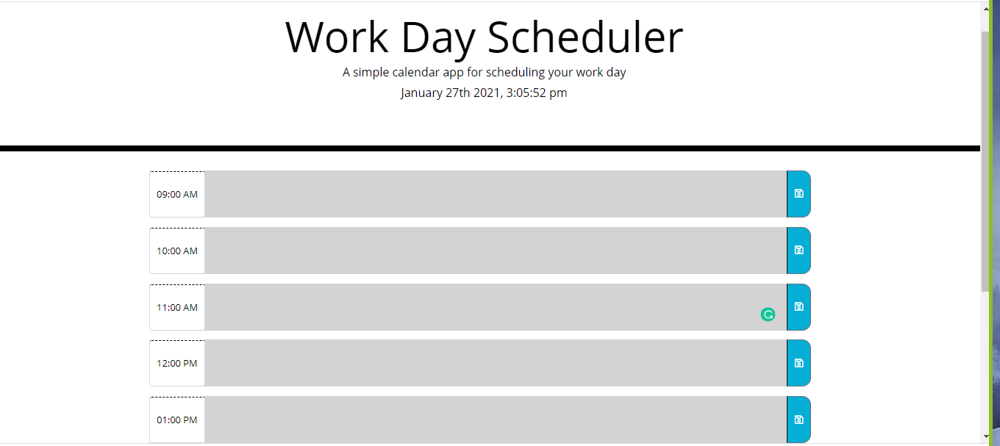

## WORK DAY SCHEDULER

This is my project where I created a a vertical work day scheduler from scratch. The Quiz includes of the criteria specified. My page is responsive and styling is according to the demo. languages used to fulfill this assignment are:
- HTML
- CSS
- JAVASCRIPT
Local storage was implemented properly to save input and
moment.js was used to  display dates and times in JavaScript. 

[link to my assignment](https://rabiahfh.github.io/Work-Day-Scheduler/)

## Contributing

1. Fork it
2. Create your feature branch (git checkout -b feature/fooBar)
3. Commit your changes (git commit -am 'Add some fooBar').
4. Push to the branch (git push origin feature/fooBar)
5. Create a new Pull Request# RfHogans-Work-Day-Scheduler
# Work-Day-Scheduler
